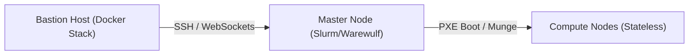

# HPC Cluster Management System

<div align="center">
  
  
  
  
  
</div>

<br />

Welcome to the **HPC Cluster Management System**. This platform is a production-grade, containerized orchestration framework designed to seamlessly provision, manage, and monitor a bare-metal High-Performance Computing (HPC) cluster from a single, unified web interface.

By combining modern web architecture (React, FastAPI, WebSockets) with industry-standard Linux administration tools (Slurm, Warewulf, Ansible), this system significantly reduces the command-line overhead traditionally required to build and scale supercomputing environments.

---

## Key Features

- **Automated Bare-Metal Provisioning**: Convert a clean physical machine into an HPC Master Node via a multi-step web wizard powered by asynchronous SSH and Ansible playbooks.
- **Stateless Compute Booting**: Manage diskless compute nodes via Warewulf 4. The system compiles OCI containers (AlmaLinux, Rocky Linux) into RAM-bootable Virtual Node File Systems (VNFS).
- **Real-Time Telemetry**: Monitor Slurm job queues, node health, and Ansible execution streams in real-time via Redis and robust WebSocket integrations.
- **Enterprise IAM & SSO**: Fully integrated Keycloak OIDC authentication enforcing MFA and RBAC across the administrative dashboard and the Open OnDemand user portal.
- **Modern User Experience**: A highly polished, responsive interface designed specifically for cluster administrators.

---

## High-Level Architecture

The system operates across three distinct tiers:

1. **The Bastion Host**: The gateway machine running the containerized orchestration stack (React, FastAPI, PostgreSQL, Redis, Keycloak, Nginx).
2. **The Master Node**: The central HPC server running core services including `slurmctld`, `warewulfd`, MariaDB, and Open OnDemand.
3. **The Compute Nodes**: Diskless physical servers booting stateless OS images entirely into RAM over an isolated provisioning network.



---

## Official Documentation

To fully understand, deploy, and extend this system, please consult the deep-dive documentation located in the [`official_docs`](./official_docs/) directory.

| Guide | Description |
|---|---|
| [01. Architecture & Design](./official_docs/01_Architecture_and_Design.md) | Comprehensive overview of High-Level and Low-Level Design, network topologies, and component interactions. |
| [02. Deployment & Installation](./official_docs/02_Deployment_and_Installation_Guide.md) | Step-by-step instructions for deploying the Docker stack and wiring the physical cluster. |
| [03. Provisioning & Warewulf](./official_docs/03_Provisioning_and_Warewulf.md) | Detailed explanation of stateless PXE booting, OCI container image management, and system overlays. |
| [04. Slurm & Workload Management](./official_docs/04_Slurm_and_Workload_Management.md) | Documentation on job scheduling, MariaDB accounting, queues, and resolving node synchronization states. |
| [05. Open OnDemand & SSO](./official_docs/05_Open_OnDemand_and_SSO.md) | Guide to integrating the user portal with Keycloak OIDC, Apache proxy configurations, and Dex. |
| [06. Operations & Troubleshooting](./official_docs/06_Operations_and_Troubleshooting.md) | The definitive Day-2 operations cheatsheet, identifying log locations, and common resolution strategies. |
| [07. Developer Guide](./official_docs/07_Developer_Guide.md) | Instructions on extending the React and FastAPI codebases and utilizing the WebSocket pipeline. |
| [08. Technology Stack](./official_docs/08_Technology_Stack.md) | An exhaustive inventory of every technology implemented and the architectural rationale behind it. |
| [09. Security, Networking & Storage](./official_docs/09_Security_Networking_and_Storage.md) | Deep dive into systemd NFS automounts, NAT firewalls, and custom SELinux policy modules. |

---

## Quick Start

To launch the web management dashboard locally for development or initial configuration:

1. Clone the repository.
2. Ensure Docker and Docker Compose are installed on your host machine.
3. Bring up the orchestration stack:
```bash
docker-compose up -d --build
```
4. Access the web portal at `http://localhost`.

For complete production setup instructions, please reference the [Deployment Guide](./official_docs/02_Deployment_and_Installation_Guide.md).
