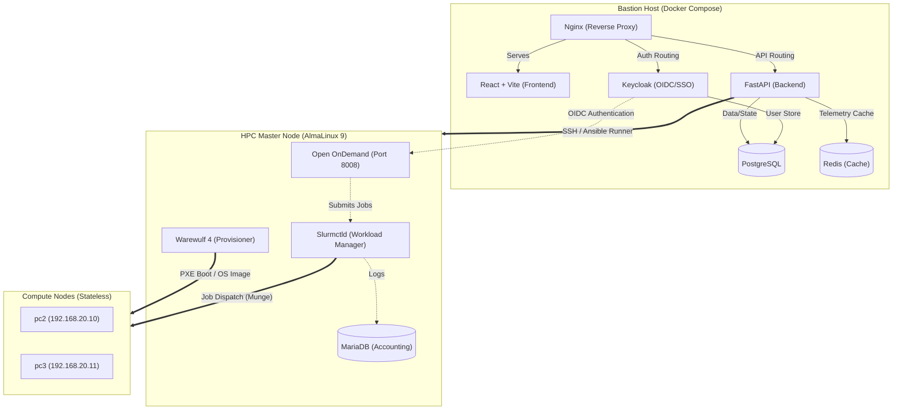
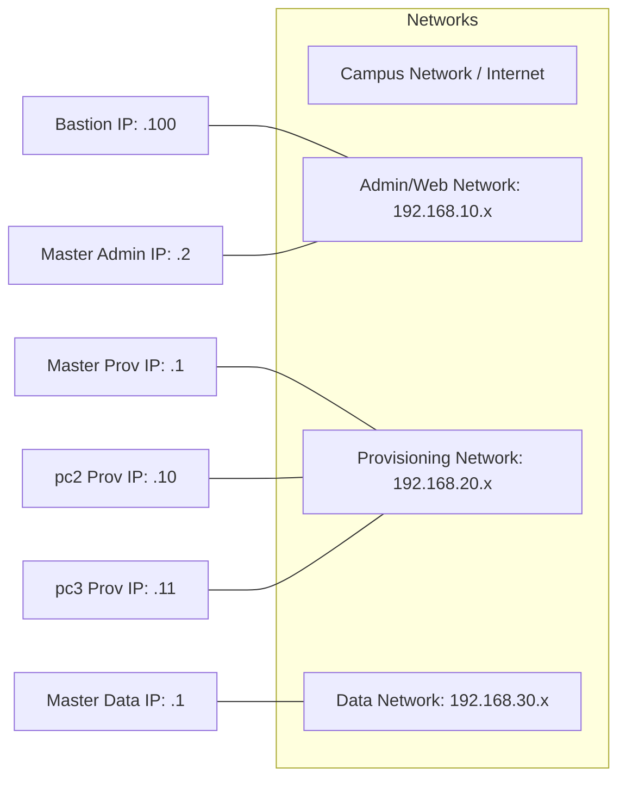

# HPC Cluster Management System Overview

This document provides a comprehensive visual plan (High-Level and Low-Level Design) of the HPC Cluster Management System you have built, along with a chronological timeline of all the steps completed throughout the project.

> [!NOTE]
> This system orchestrates a bare-metal HPC cluster using modern web technologies, containerization, and configuration management tools.

---

## 🏗️ High-Level Design (HLD)

The system consists of three main physical/logical layers:
1. **Bastion Host (Your Laptop)**: Runs the containerized web orchestration application.
2. **Master Node (Head Node)**: Runs the core HPC services (Slurm, Warewulf) and the Open OnDemand user portal.
3. **Compute Nodes**: Stateless machines provisioned completely into RAM over the network.

---

## 🔬 Low-Level Design (LLD)

### Networking & Interfaces

### Application Components
* **Frontend (`hpc-cluster-ui`)**: 
  * Uses TailwindCSS, glassmorphism UI, and websockets.
  * Contains a Node Registry Grid, Ansible Automation Runner interface, and Master Setup wizard.
* **Backend API (`FastAPI`)**:
  * **`/api/v1/slaves`**: Manages compute node configurations.
  * **`/api/v1/images`**: Interfaces with Warewulf to compile Golden Images (AlmaLinux, Rocky, Ubuntu).
  * **`/api/v1/ansible`**: Triggers async SSH/Ansible playbooks (e.g., `ood_install.yml`) with WebSocket log streaming.
* **Open OnDemand Configuration**:
  * Hosted securely via Apache (`ood_portal.yml`) utilizing `X-Forwarded` proxy headers.
  * Authenticated centrally via Keycloak OIDC (dex integration).
  * Uses custom SELinux modules (`ood_custom.te`) to allow Passenger apps (Job Composer) to manage home directories.

---

## 📜 Complete History of Completed Steps

Based on the conversation and development history, here is the chronological list of everything that has been set up:

### Phase 1: Core Dashboard & Containerization
1. **Frontend Scaffolding**: Built a modern React + TypeScript (Vite) application featuring a Node Registry Grid, multi-step provisioning wizard, and ARP network scanner UI.
2. **Backend & Containerization**: Scaffolded the FastAPI backend with PostgreSQL and Redis. Wrapped the entire web stack (Nginx, React, FastAPI, Keycloak, Postgres, Redis) in `docker-compose.yml`.
3. **UI/UX Polishing**: Implemented premium glassmorphism styling, dark mode typography, and scaffolded real-time cluster telemetry panels.

### Phase 2: HPC Infrastructure Stabilization
4. **Warewulf & Slurm Fixes**: Resolved compute node Slurm `DRAIN` and `INVALID_REG` errors. Integrated `chrony` time synchronization directly into the stateless AlmaLinux 9 images and forced `slurmd` to wait for clock sync on boot to prevent Munge token issues.
5. **Feature Trimming**: Surgically removed the incomplete Job Scheduling and Accounting modules from the UI to focus strictly on robust cluster provisioning and Open OnDemand integration.
6. **Golden Images**: Extended the image compiler UI and backend forms to support multiple OCI container bases (AlmaLinux 10, Rocky 9/10, Ubuntu 22/24).

### Phase 3: Automation & Integrations
7. **Ansible Runner UI**: Created the Ansible Automation Runner page in the frontend, enabling administrators to execute playbooks dynamically on the Master Node with real-time streaming logs via WebSockets.
8. **Open OnDemand & Keycloak SSO Integration**: Mapped Keycloak to Apache OIDC token authentication flow. Reconfigured Open OnDemand to use Dex Identity Provider for form-based login within the dashboard iframe, and enforced bcrypt hashing for `htpasswd`.

### Phase 4: Security & Open OnDemand Troubleshooting
9. **SELinux & User Permissions**: Built a `/etc/ood/config/create_user_home.sh` pre-hook to automatically provision user directories. Compiled a custom SELinux module (`ood_custom.te`) granting `ood_pun_t` access to `config_home_t` to resolve Passenger `EEXIST` errors.
10. **URL Routing & Proxies**: Fixed malformed URL routings pointing to the OOD dashboard port 8008.
11. **Job Composer Fixes**: Resolved `422 Invalid Authenticity Token` (CSRF) errors in the OOD Job Composer app by injecting custom proxy headers (`X-Forwarded-Proto`, etc.) via Apache and configuring Rails trusted proxies.
