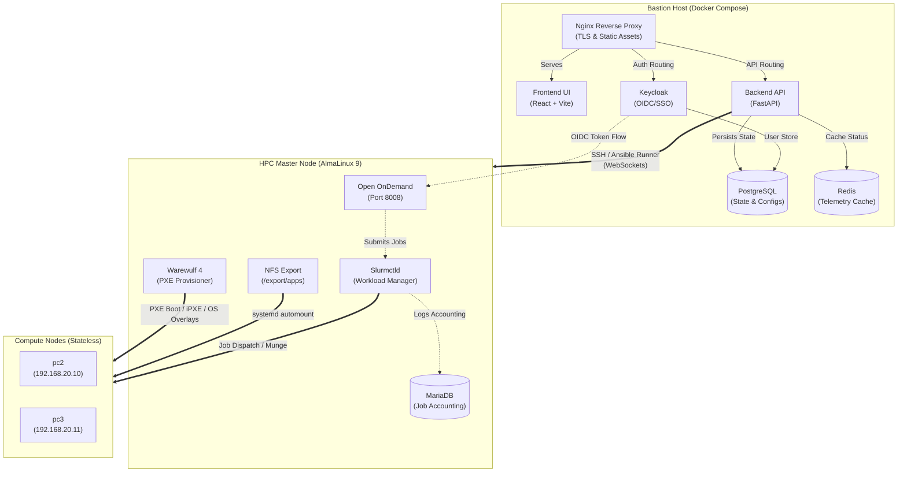
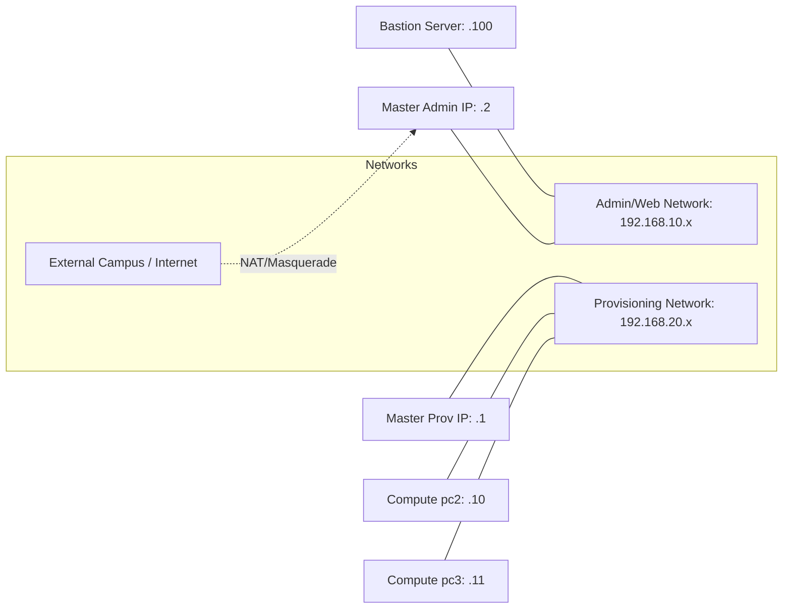

# HPC Cluster Management System — Architecture & Design

This document details the architectural blueprint of the HPC Cluster Management System. The system bridges modern, responsive web application paradigms with bare-metal Linux administration, creating a seamless platform for provisioning, scheduling, and monitoring a High-Performance Computing cluster.

---

## 1. High-Level Design (HLD)

The infrastructure follows a multi-tiered architecture split logically and physically into three primary layers: the **Bastion Host** (control plane wrapper), the **Master Node** (HPC brain), and the **Compute Nodes** (stateless muscle).

### Component Flow

### The Three Layers Explained

1. **The Bastion Host (Orchestration Hub)**: 
   This is the machine running the dockerized cluster management application. It sits outside the core cluster (often on an administrator's laptop or a dedicated management server) and uses SSH and Ansible to reach into the Master Node.
2. **The Master Node (Head Node)**: 
   The heart of the HPC cluster. It runs `slurmctld` to manage workloads, `warewulfd` to handle PXE booting of compute nodes, `chronyd` for strict time synchronization, and Apache serving Open OnDemand for end-user interaction.
3. **The Compute Nodes (Execution Units)**: 
   These are entirely stateless, diskless machines. They boot over the network (PXE/iPXE), download an OS image into RAM, receive their cryptographic identities (Munge keys) via Warewulf overlays, and immediately report to Slurm for job processing.

---

## 2. Low-Level Design (LLD)

### Network Topology & Interfaces

The system requires strict network separation to prevent DHCP collisions and ensure secure internal traffic routing.

- **Admin Network (`192.168.10.x`)**: Secure network where administrators access the React dashboard and Keycloak instance. The Bastion host targets the Master node via SSH over this interface.
- **Provisioning Network (`192.168.20.x`)**: Completely isolated network attached to a D-Link unmanaged switch. Warewulf runs a DHCP/TFTP server on this interface to orchestrate stateless compute node boots.

### Web Application Architecture

#### **1. React Frontend (The Dashboard)**
- Uses **TailwindCSS** for a responsive, modern, glassmorphism UI.
- Implements a stateful multi-step wizard for configuring Master node parameters (network bounds, timezones).
- Contains real-time telemetry panels showing node health, queue times, and live logs from ongoing background installations using WebSockets.

#### **2. FastAPI Backend (The Control Plane)**
- Operates primarily asynchronously. Installation scripts, which can take upward of 30 minutes (e.g., compiling software or pulling large OCI container images), are spawned as background tasks.
- **WebSockets** are utilized to pipe the `stdout` and `stderr` streams from the Python `asyncssh` or `ansible-runner` modules directly back to the React UI, preventing browser timeouts and providing real-time feedback.
- Uses **SQLAlchemy** connected to PostgreSQL to map and persist JSON configuration payloads representing cluster profiles (e.g., different subnet configs or Golden Image OCI URLs).

### Identity & Authentication Flow

1. A user attempts to hit the Open OnDemand portal or the HPC Dashboard.
2. The user is redirected to the **Keycloak** identity provider.
3. Upon successful login (with optional MFA), Keycloak issues a cryptographically signed JSON Web Token (JWT).
4. The dashboard APIs validate this token. For Open OnDemand, the Dex OIDC provider (integrated via Apache `mod_auth_openidc`) verifies the token and maps the Keycloak username to a local Linux system user on the Master Node.

### Storage & Filesystem Subsystem

Compute nodes possess no local storage. Everything is centralized on the Master Node.
- `/export/apps`: The primary NFS share where global software (compiled via Spack) and Lmod modulefiles are stored.
- **Systemd Automounting**: Instead of relying on `/etc/fstab` in the stateless images, the cluster utilizes `export-apps.mount` and `export-apps.automount` systemd drop-ins distributed via Warewulf overlays. This ensures that the `/export/apps` share is only mounted upon first access, mitigating boot-time hangs if the Master node's NFS server is slow to start.
