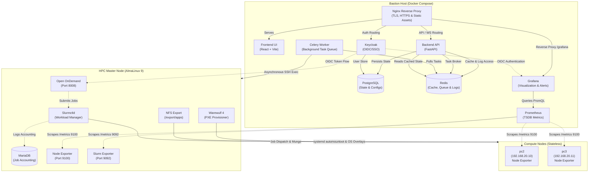
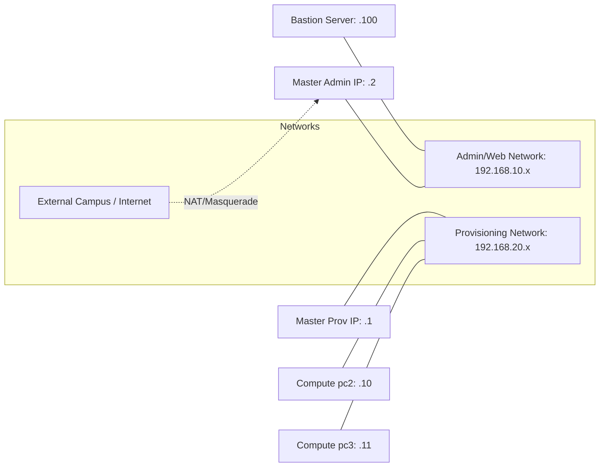

# HPC Cluster Management System — Architecture & Design

This document details the architectural blueprint of the HPC Cluster Management System. The system bridges modern, responsive web application paradigms with bare-metal Linux administration, creating a seamless platform for provisioning, scheduling, and monitoring a High-Performance Computing (HPC) cluster.

---

## 1. High-Level Design (HLD)

The infrastructure follows a multi-tiered architecture split logically and physically into three primary layers: the **Bastion Host** (control plane wrapper), the **Master Node** (HPC brain), and the **Compute Nodes** (stateless muscle). This separation of concerns ensures that the web orchestration layer does not interfere with the mission-critical HPC scheduling and routing performed by the Master Node.

### Component Flow

### The Three Layers Explained

1. **The Bastion Host (Orchestration Hub)**: 
   The Bastion Host represents the modern web-control plane. It runs the dockerized cluster management application and completely isolates the management web interface from the HPC compute environment. 
   - **FastAPI Services**: Handles RESTful interactions from the UI, validating user inputs and converting them into actionable infrastructure commands.
   - **Celery Worker**: Replaces blocking REST calls with asynchronous background execution, ensuring the UI remains responsive during 20+ minute Warewulf OS image builds.
   - **Redis**: Acts as the central nervous system for state transfer—managing the Celery message broker, acting as a live tail-log buffer for WebSockets, and caching expensive Slurm queries to prevent SSH connection storms.
   - **Keycloak, Prometheus, & Grafana**: Provide Enterprise SSO (Single Sign-On), hardware telemetry scraping, and rich visualization respectively.

2. **The Master Node (Head Node)**: 
   The heart of the HPC cluster. Unlike the Bastion Host which manages *orchestration*, the Master Node handles *operation*.
   - **Slurmctld**: The primary workload manager, routing computational jobs to available nodes based on strict queuing policies.
   - **Warewulf 4 (wwctl)**: The bare-metal provisioner. It handles PXE network booting for the compute nodes and serves the base operating system image directly into node RAM.
   - **Chrony & Munge**: `chronyd` enforces strict time synchronization across the cluster, a critical prerequisite for `munge`, which cryptographically signs all Slurm payloads to authenticate node-to-node communication.
   - **Open OnDemand (OOD)**: An Apache-based web portal that provides researchers with graphical SSH terminals, Jupyter notebooks, and job submission forms directly in their browser.

3. **The Compute Nodes (Execution Units)**: 
   These are entirely stateless, diskless machines. They contain CPU, RAM, and potentially GPUs, but no persistent OS storage.
   - They boot over the network via PXE/iPXE.
   - They download a compressed OS image (VNFS) into their RAM disk.
   - They receive their unique identities, network configurations, and Munge keys via Warewulf overlays dynamically at boot time.
   - They run `slurmd` to accept jobs from the Master Node, and local `node_exporter` instances to stream their health telemetry back to Prometheus on the Bastion Host.

---

## 2. Low-Level Design (LLD)

### Network Topology & Interfaces

The system requires strict network separation. Bridging the campus network and the cluster provisioning network would result in catastrophic DHCP collisions (as Warewulf acts as a rogue DHCP server).

- **Admin Network (`192.168.10.x`)**: This is the secure management network. Administrators access the React dashboard, Grafana, and Keycloak instances via this subnet. The Bastion host targets the Master node via SSH specifically over this interface.
- **Provisioning Network (`192.168.20.x`)**: A completely isolated network (typically attached to a standalone unmanaged switch). Warewulf runs its DHCP/TFTP server exclusively on this interface. Compute nodes exist only on this network. NAT routing is configured on the Master Node to allow compute nodes to reach the internet for package downloads if required.

### Web Application Architecture

#### **1. React Frontend (The Dashboard)**
- **Tech Stack**: Built with React 18, TypeScript, and Vite.
- **Aesthetic System**: Uses **TailwindCSS** to enforce a "Premium Glassmorphism" design. Custom CSS classes apply varying degrees of `backdrop-blur` and semi-transparent RGBA backgrounds to create depth and hierarchy.
- **Statefulness**: Implements a stateful multi-step wizard for configuring Master node parameters (network bounds, timezones, slurm config).
- **Telemetry Integration**: Contains real-time telemetry panels showing node health, queue times, and live logs from ongoing background installations using WebSockets. Grafana is seamlessly embedded via iframes for rich historical hardware metrics.

#### **2. FastAPI Backend (The Control Plane)**
- **Event-Driven Execution**: Uses an event-driven Celery & Redis architecture to decouple HTTP requests from bash execution.
- **Redis Log Streaming Pipeline**:
  1. A client initiates a long-running task (e.g., Image Compilation).
  2. FastAPI fires a Celery task and returns a `task_id`.
  3. The Celery worker executes the command via `asyncssh`, capturing `stdout`/`stderr` and pushing it to a Redis List (`rpush task_logs:{task_id}`).
  4. The client connects to a generic WebSocket endpoint which tails the Redis List. This architecture ensures complete fault tolerance; if the browser refreshes, the WebSocket replays the entire history from Redis without interrupting the background Celery process.
- **Debounced Operations**: High-impact infrastructure commands (like `wwctl overlay build -A`) are debounced using Redis timestamps and Celery `countdown` parameters. If an admin creates 10 users rapidly, the overlay rebuild only executes once at the end, preventing CPU spikes on the Master Node.

### Identity & Authentication Flow

1. A user attempts to hit the Open OnDemand portal, Grafana, or the HPC Dashboard.
2. The user is redirected to the **Keycloak** identity provider via OpenID Connect (OIDC).
3. Upon successful login (with optional MFA), Keycloak issues a cryptographically signed JSON Web Token (JWT).
4. **Dashboard & Grafana**: Validate the JWT directly via API middleware.
5. **Open OnDemand (OOD)**: The Dex OIDC provider (integrated via Apache `mod_auth_openidc`) verifies the token and dynamically maps the Keycloak username to a local Linux system user (`/etc/passwd`) on the Master Node. 

### Storage & Filesystem Subsystem

Because compute nodes possess no local storage, everything is centralized on the Master Node and distributed over the network.
- `/export/apps`: The primary NFS share where global software (compiled via Spack) and Lmod modulefiles are stored.
- **Systemd Automounting**: Instead of hardcoding NFS mounts into `/etc/fstab` on the stateless images (which could cause infinite hangs during boot if the NFS server is slow to start), the cluster utilizes `export-apps.mount` and `export-apps.automount` systemd drop-ins distributed via Warewulf overlays. This ensures that the `/export/apps` share is mounted *lazily* only upon first access by a user or job.
