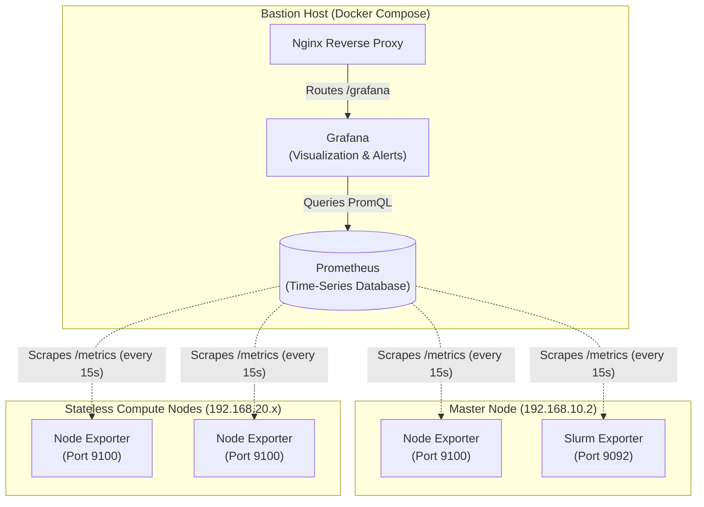

# HPC Cluster Management System — Hardware Telemetry & Monitoring

This document details the architecture, configuration, and integration of deep hardware telemetry into the HPC Cluster Management System using **Grafana** and **Prometheus**. 

While the React dashboard handles orchestration metadata (e.g., node states, Slurm queues, configuration), Grafana and Prometheus provide historical, high-resolution performance metrics (e.g., CPU throttling, memory swap, temperature, network I/O).

---

## 1. Why Prometheus & Grafana?

Your existing telemetry architecture relies on the FastAPI backend polling Slurm, caching the state in Redis, and pushing it to the React frontend. 

**What React + Slurm + Redis is good for:**
- Orchestration state ("Is the node Idle, Allocated, or Down?")
- Live job queue visibility ("Who is running Job ID 412?")
- High-level cluster overview.

**What Grafana + Prometheus is good for:**
- **Historical Troubleshooting:** "Why did a job crash at 2:00 AM last night? Did the node run out of memory?"
- **Micro-metrics:** Core-by-core CPU utilization, GPU power draw, disk read/write IOPS, thermal throttling.
- **Alerting:** Automated emails, Slack messages, or Webhooks if a node goes offline, storage exceeds 90%, or temperatures cross a dangerous threshold.

By offloading hardware graphing to Grafana, the React dashboard remains lightweight and focused on administration, avoiding the need to write complex time-series graphing components from scratch.

---

## 2. Telemetry Architecture

The telemetry stack is distributed across the three main layers of the HPC environment: the **Bastion Host**, the **Master Node**, and the **Compute Nodes**.

### Component Flow



### 1. The Sensors (Node Exporters)
To get data from Linux machines, we deploy **Prometheus Node Exporter**, a lightweight background daemon written in Go.
- **How it works:** It reads Linux kernel statistics directly from the virtual filesystems (`/proc` and `/sys`) and exposes them over an HTTP server on port `9100` at the `/metrics` endpoint.
- **Master Node:** Installed directly via RPM/Systemd.
- **Compute Nodes:** Injected seamlessly into the stateless RAM-disk image using **Warewulf 4 overlays**. When a compute node boots, Warewulf ensures Node Exporter starts automatically without requiring manual software installation.

### 2. The Database (Prometheus)
Prometheus is a time-series database running as a Docker container on the Bastion Host. 
- **How it works:** Instead of nodes "pushing" data to a central server (which can cause bottlenecks), Prometheus uses a "pull" model. Every 15 seconds, Prometheus makes an HTTP request to `http://<node-ip>:9100/metrics` for every node in the cluster. 
- It stores this data highly efficiently on disk, allowing complex mathematical queries (PromQL) over long periods.

### 3. The UI (Grafana)
Grafana sits next to Prometheus on the Bastion Host (also in Docker).
- **How it works:** When an administrator opens Grafana, it queries the Prometheus database and renders the raw data into interactive, zoomable dashboards.

---

## 3. Integration with the Management System

To make this seamless for administrators, Grafana integrates tightly into the existing HPC stack:

### A. Deployment via Docker Compose
Grafana and Prometheus are added directly to the existing `docker-compose.yml` on the Bastion Host. They run on the internal `hpc-network`, entirely hidden from the public internet.

### B. Single Sign-On (SSO) with Keycloak
Administrators shouldn't have to log in to the React dashboard and then log in again to Grafana. 
- Grafana is configured to use **Generic OAuth / OpenID Connect (OIDC)**. 
- It points directly to the existing **Keycloak** container. 
- When a user clicks "Telemetry" in the React dashboard, Grafana automatically authenticates them using their existing Keycloak session.

### C. Nginx Reverse Proxy
To avoid opening extra ports on the Bastion Host firewall, the existing `nginx.conf` is updated. Traffic hitting `https://<bastion-ip>/grafana/` is proxied to the Grafana container, keeping everything under a single secure origin.

### D. Embedded React Panels (Optional)
Grafana allows "Anonymous Viewing" for specific dashboards or panels. If desired, specific CPU/RAM charts can be embedded natively into the React Frontend using secure `<iframe>` tags. This creates a unified UI where users don't even realize they are looking at Grafana.

---

## 4. Troubleshooting HPC Scenarios with Grafana

Once this stack is running, administrators can solve complex issues that the Slurm metadata alone cannot answer:

### Scenario 1: The "Silent Killer" (OOM - Out of Memory)
**Problem:** A researcher submits a deep learning job. It runs for 3 hours and then vanishes. Slurm reports the job failed, but the researcher doesn't know why.
**Grafana Solution:** The administrator zooms into the timeframe on Grafana. They see the memory usage of the assigned compute node steadily climb to 100%, followed by a massive spike in Swap usage, right before the Linux OOM (Out of Memory) Killer terminates the process to save the OS. 
**Action:** Tell the researcher to request more memory in their Slurm script (`#SBATCH --mem=...`).

### Scenario 2: Storage I/O Bottlenecks
**Problem:** A cluster of 10 nodes is calculating a fluid dynamics simulation. All nodes are active, but CPU usage is only at 10%. Why is it slow?
**Grafana Solution:** Checking the `Network Transmit/Receive` and `Disk IOPS` dashboards reveals that the `/export/apps` NFS share on the Master Node is completely saturated. The compute nodes are spending 90% of their time waiting for file reads over the network (I/O Wait).
**Action:** Upgrade the Master Node's network interface to 10GbE or implement a parallel filesystem.

### Scenario 3: Thermal Throttling
**Problem:** Node `pc2` is consistently finishing identical jobs 30% slower than `pc3`. 
**Grafana Solution:** The Hardware Temperature dashboard shows `pc2` hovering at 95°C during load, triggering Intel/AMD thermal throttling (automatically lowering the CPU clock speed to prevent fire), while `pc3` sits comfortably at 70°C.
**Action:** Check the thermal paste or cooling fan physically on `pc2`.

---

## 5. Active Telemetry Reference & Verification

The telemetry stack is fully automated and deployed as part of the core cluster startup.

### Active Configurations

1. **Bastion Host Docker Services:**
   Prometheus and Grafana services run within the Docker Compose stack.
   - **Prometheus** configuration: Mounts `/prometheus/prometheus.yml` containing the scrape targets for the Master Node (`192.168.10.2:9100`), Slurm Exporter (`192.168.10.2:9092`), and compute nodes (`192.168.20.10:9100`, etc.).
   - **Grafana** configuration: Mounts volume plugins and environment-based OIDC parameters linking authentication directly to the Keycloak container.

2. **Nginx Reverse Proxy Integration:**
   `nginx/nginx.conf` exposes Grafana at `/grafana/`:
   ```nginx
   location /grafana/ {
       proxy_pass http://hpc-grafana:3000/;
       proxy_set_header Host $host;
       proxy_set_header X-Real-IP $remote_addr;
       proxy_set_header X-Forwarded-For $proxy_add_x_forwarded_for;
       proxy_set_header X-Forwarded-Proto $scheme;
   }
   ```

3. **Master Node Exporters:**
   - **Node Exporter:** Active on port `9100` (`systemctl status prometheus-node-exporter`).
   - **Slurm Exporter:** Active on port `9092` (`systemctl status prometheus-slurm-exporter`), reading directly from the `slurmctld` process memory and config files.

4. **Compute Nodes Overlay Automation:**
   The Warewulf `nodeconfig` overlay contains:
   - The `/usr/bin/node_exporter` binary.
   - A systemd service template `/etc/systemd/system/node_exporter.service` which triggers Node Exporter automatically on boot.

5. **Keycloak OIDC Integration:**
   Grafana's `grafana.ini` has OIDC activated:
   ```ini
   [auth.generic_oauth]
   enabled = true
   name = Keycloak
   client_id = hpc-grafana
   client_secret = <grafana-client-secret>
   scopes = openid email profile
   auth_url = https://192.168.10.100/realms/hpc/protocol/openid-connect/auth
   token_url = http://hpc-keycloak:8080/realms/hpc/protocol/openid-connect/token
   api_url = http://hpc-keycloak:8080/realms/hpc/protocol/openid-connect/userinfo
   role_attribute_path = contains(roles[*], 'admin') && 'Admin' || 'Viewer'
   ```
   *(Note: Internal URLs point directly to the Docker service name `hpc-keycloak` to prevent internal container networking errors.)*

### Verification Steps

To verify telemetry is gathering metrics:
1. Log in to the management dashboard.
2. Click **Telemetry** in the sidebar navigation (redirects to `/grafana/`).
3. Log in with your Keycloak credentials if prompted.
4. Open the **Node Exporter Full** dashboard to view real-time and historical CPU, Network, and Disk graphs for the entire cluster.
5. Query the Prometheus status page directly via container log inspection to verify all scrape targets are green:
   ```bash
   docker-compose logs -f prometheus
   ```
