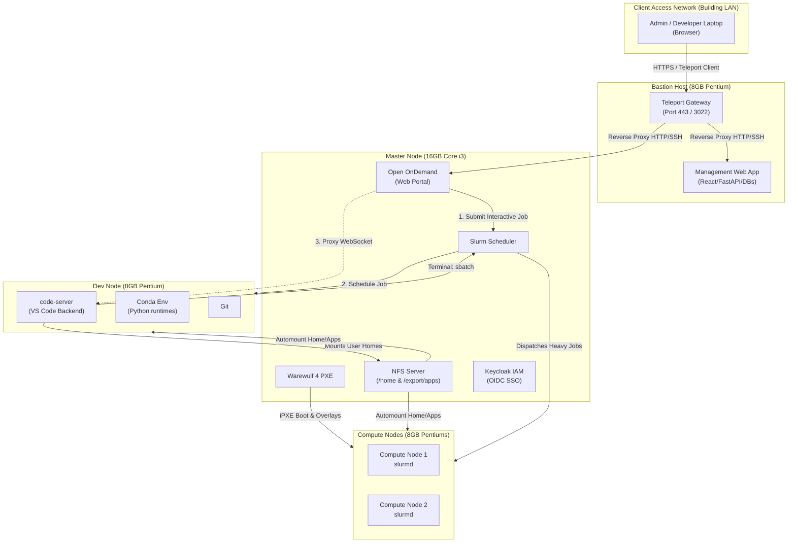

# HPC Cluster Management System — Hardware Reconfiguration & App Server Integration

This document outlines the final architectural topology and step-by-step implementation details for a 5-node HPC cluster. It specifically addresses how to distribute roles across machines with varying hardware specifications (16GB Core i3 vs. 8GB Pentiums), how to configure a dedicated development node for interactive apps, and how to structure secure gateway access.

---

## 1. Hardware Allocation & Rationale

You have **5 physical machines** available:
*   1x Core i3 with 16 GB RAM
*   4x Pentium with 8 GB RAM

### Recommendation: Which machine gets the 16 GB RAM?
**The Master Node should be the Core i3 with 16 GB RAM.**

*Why?* If you strictly limit the Dev Node to a maximum of **2 concurrent users**, an 8GB Pentium is sufficient to run two VS Code backend sessions without crashing. 

Because the Dev Node will not be heavily saturated, the **Master Node** becomes the most critical bottleneck in the cluster. The Master Node runs Keycloak (a heavy Java application), Open OnDemand (Ruby), MariaDB, Slurmctld, and acts as the NFS and Warewulf server.
Giving the Master Node the 16GB Core i3 provides immense benefits to the entire cluster:
1.  **Massive NFS Caching:** Linux uses unused RAM to cache file reads. With 16GB of RAM, the Master Node will cache frequently accessed files in memory, making file access lighting-fast for all Compute and Dev nodes.
2.  **Faster PXE Boots:** Warewulf image distribution to compute nodes will be significantly faster with a better CPU and RAM.
3.  **Responsive UI:** Keycloak and Open OnDemand will load much faster for users logging into the cluster.

### Final Hardware Assignment
1.  **Master Node** (Core i3, 16 GB RAM): Open OnDemand (OOD), Slurm Controller (`slurmctld`), Warewulf, Keycloak, NFS Server, MariaDB.
2.  **Bastion Host** (Pentium, 8 GB RAM): Teleport Gateway, Management Web App (React, FastAPI, Celery, Redis, Postgres).
3.  **Dev Node** (Pentium, 8 GB RAM): VS Code Server, Git, Conda. Acts as a Slurm Client to submit jobs.
4.  **Compute Node 1** (Pentium, 8 GB RAM): Pure Slurm execution (`slurmd`).
5.  **Compute Node 2** (Pentium, 8 GB RAM): Pure Slurm execution (`slurmd`).

---

## 2. Network & Logical Topology



---

## 3. The Interactive Application Flow (How VS Code Works)

Understanding exactly how the workload is distributed is critical:
1.  **The User's Laptop** renders the VS Code UI (HTML/CSS/JS) in their web browser.
2.  **The Master Node (16GB Core i3)** hosts the Open OnDemand dashboard. When the user requests VS Code, OOD submits an `sbatch` job to the Slurm controller.
3.  **The Dev Node (8GB Pentium)** is where the VS Code backend (`code-server`) boots up. This node handles indexing files and running language servers for up to 2 concurrent users.
4.  **The Compute Nodes (8GB Pentiums)** remain totally free. When the developer is ready to run their heavy workload, they open the terminal inside VS Code (on the Dev node) and type `sbatch my_heavy_job.sh`. The job is routed by the Master Node to the Compute Nodes for execution.

---

## 4. Implementation Guide (Step-by-Step)

### Step 1: Network & Bare Metal Setup
1.  **Bastion Host:** Connect to the external Building LAN (`192.168.10.x`) AND the internal cluster switch (`192.168.20.x`). Install AlmaLinux 9.
2.  **Master Node:** Connect ONLY to the internal cluster switch (`192.168.20.2`). Install AlmaLinux 9.
3.  **Dev Node & Compute Nodes:** Connect ONLY to the internal cluster switch. Configure their BIOS to network boot (PXE) from the Master Node.

### Step 2: Bastion Host Configuration
1.  Install **Teleport** to act as the reverse proxy for all incoming traffic.
2.  Deploy the **Management Web App** (Docker stack) on this node.
3.  Configure Teleport to route specific subdomains (e.g., `ood.cluster.local`) to the Master Node (`192.168.20.2`).

### Step 3: Master Node Configuration
1.  **NFS Server:** Export `/home` and `/export/apps` to the `192.168.20.0/24` subnet.
2.  **Warewulf:** Initialize Warewulf and import the AlmaLinux 9 container image. Add the Dev Node and 2 Compute Nodes to the Warewulf inventory.
3.  **Slurm Controller (`slurmctld`):** Configure `/etc/slurm/slurm.conf`. This is a critical step:
    ```ini
    # slurm.conf excerpt
    ControlMachine=master
    
    # Define Nodes
    NodeName=dev-node CPUs=4 RealMemory=15000 State=UNKNOWN
    NodeName=compute-[1-2] CPUs=2 RealMemory=7500 State=UNKNOWN
    
    # Define Partitions
    PartitionName=interactive Nodes=dev-node Default=NO MaxTime=08:00:00 State=UP
    PartitionName=compute Nodes=compute-[1-2] Default=YES MaxTime=INFINITE State=UP
    ```
4.  **Keycloak & OOD:** Install Keycloak for IAM and Open OnDemand for the web portal. Ensure OOD's `cluster.yml` points to the local Slurm controller.

### Step 4: Dev Node & Compute Node Provisioning
1.  Boot the Dev Node and Compute Nodes via PXE (Warewulf).
2.  Ensure they mount `/home` and `/export/apps` from the Master Node via `/etc/fstab` (configured via Warewulf overlays).
3.  Ensure `slurmd` starts successfully on all three nodes.

### Step 5: OOD Interactive App Configuration
To ensure VS Code launches on the 8GB Dev Node (and not the Compute nodes):
1.  On the Master Node, edit the VS Code app's submit configuration (`/var/www/ood/apps/sys/vscode/submit.yml.erb`).
2.  Force the app to submit to the `interactive` partition:
    ```yaml
    ---
    batch_connect:
      template: "basic"
    script:
      native:
        - "--partition=interactive"
        - "--nodes=1"
        - "--ntasks=1"
    ```
3.  Install Conda and the `code-server` binary into the shared NFS directory (`/export/apps/`), so the Dev Node can access it when the job starts.

---

## 5. Summary of Authentication (Auth) Flow
1.  **User logs into Teleport/OOD:** Authenticated via Keycloak (running on the Master Node).
2.  **OOD spawns VS Code:** OOD submits the job as the Linux user. The Master Node ensures the Linux user exists (UID/GID mapping).
3.  **VS Code on Dev Node:** Because the Dev Node boots an image from Warewulf and mounts `/home` via NFS, the user's files and permissions are perfectly synchronized. UID/GID conflicts are eliminated.

---

## 6. Fair Usage & Quality of Service (QoS)
Because the 8GB Dev Node has limited RAM, resources can be quickly exhausted if even 2 developers leave VS Code sessions open with heavy language servers running.
1.  **Time Limits:** Slurm forces the `interactive` partition to a maximum of 8 hours. Idle sessions are killed overnight.
2.  **Job Limits:** Use `sacctmgr` to enforce QoS, limiting users to a maximum of 1 active interactive session at a time, preventing them from hoarding Dev Node memory.
